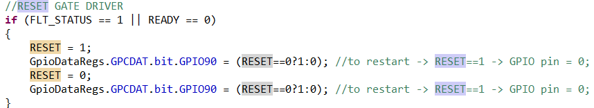

# SinglePhaseProject

## Required Software & Packages

1. TI Code Composer Studio v10
2. TI C2000Ware v5.0.0.00

## Environment Configuration Selected

## Precompilation Configuration
Several macro definition located in “Amain.h” should be configured to run the inverter at desired modes before compiling and building the project. 

Macro “ControlType” is the primary macro to define the inverter operation mode. 

Only when “ControlType” is defined as “SingleLoopGfm” or “DualLoopGfm”, the macro “GfmType” determines the GFM power loop algorithm as droop, VSM, or dVOC.

Macro “PwmMethod” controls PWM method as either unipolar PWM or bipolar PWM. Default value of “PwmMethod”is Unipolar Pwm.

## Key Control & Flag Variables
Here in the following table : Write (Writable) means we can or need to change the value of the variables in CCS watching window for nominal operation.

GFM-Control related references such as PQ references are not listed here. Her only key variables for startup, protection, monitoring, and nominal operation are listed.

|Variable | Read or Write |Description|
|:-------------:|:-------------:| :-----:|
| SYNC_STATUS   | Read/Write          | SYNC_STATUS=1, inverter running at PreSync Mode; SYNC_STATUS=0, inverter exits PreSync Mode. Note that when RELAY==1, SYNC_STATUS is automatically cleared.|
| FLT_STATUS   | Read        | 0: no fault output from gate drivers; 1: fault detected by gate drivers.|
| READY      | Read | 0: MOSFET gate drivers not ready; 1: all ready; |
| RESET    | Read | Set and cleared to reset the gate driver;  |

|Variable | Read or Write |Description|
|:-------------:|:-------------:| :-----:|
| RELAY   | Read         | RELAY=SW2; SW2 is a manual switch. By changing this manual switch position, we can drive GPIO35 to turn on/off the relay on AC side.|

|Variable | Read or Write |Description|
|:-------------:|:-------------:| :-----:|
| ClearTripFlag   | Read/Write        | Set (=1) to clear the fault, enable the PWM, intialize the controller, and reset the gate drivers. Then it will automatically clear (=0) itself.|

|Variable | Read or Write |Description|
|:-------------:|:-------------:| :-----:|
| FaultTypeFlag   | Read        | Show different fault types; 0: no fault; 1: AC over currrent from software; 2: gate driver FO; 3: manually tripped by manual switch SW6.|

## GFM SOP (dVOC control with inner loops):
1. Before power on: 

* Make sure the hardware connection is set correctly with relay off.
* Make sure the controlCARD is set correctly (referring to 1.5kW hardware design documents Section ControlCARD Setting).
* Make sure manual switches at the right position:
    * SW2==0 so that RELAY is off
    * SW6==0 so that no manual trip
    * SW5==0 so that no manual  trip clearance signal is given.
* In the codes Amian.h, here we set macro definition as below
    *  #define GfmType GfmdVOC
    *  #define ControlType DualLoopGfm
    *  #define PwmMethod UnipolarPwm
* In Amain.c — KeyInit(); set Pref = 0, Qref=0, and Imax as your tolerated maximum magnitude of AC current for software protection.

2. 12V DC power on, 200V DC power on (set enough current limit s.t. it does not affect nominal operation)

3. Build, debug and run the codes on CCS.

4. Check readable variables are at desired value: (FLT_STATUS==0, READY==1, fAULTtYPEfLAG==0, SYNC_STATUS==0, RELAY==0,…)

5. In watch window, set ClearTripFlag=1 to run dVOC control with inner loops. 

6. For standalone operation: You can then change the position of SW2 to turn on/off the RELAY if u want to connect/disconnect some AC loads.

7. For grid-tied operation: 
  a. Make sure the relay is off and the grid is ready on POC. 
  b. Set Pref=Qref=0. 
  c. Let SYNC_STATUS=1 in watch window so that the inverter operates under PreSyncMode.
  d. When AC cap voltage and grid voltage gets sync, control SW2 to turn on the relay. Naturally, we will have SYNC_STATUS==0 in the logic and the inverter is running at GFM operation.

8. Change the value of Pref in CCS watch window to change power output.

9. To stop inverter operation:
  a. Set manual switch  SW6=1 to manually trip the inverter
  b. Clear manual switch SW2=0 to turn off the relay
  c. Optional: turn off all power supplies

10. If tripped by fault:
  a. Set manual switch  SW6=1 to manually trip the inverter
  b. Clear manual switch SW2=0 to turn off the relay
  c. Check faulttype to find out what triggers the fault.
  d. Optional: turn off all power supplies

11. To restart without loading codes again:
  a. Make sure SW6==1, SW5==0.
  b. Set SW5=1 and then SW5=0. ← This is to make sure PWM still disabled but to run KeyInit();
  c. Let SW6=0.
  d. Go back to Step 4.

### Project: SinglePhaseGFM_1500W_120V

#### Include Options
- Include search paths:
  - `${COM_TI_C2000WARE_SOFTWARE_PACKAGE_INCLUDE_PATH}`
  - `${CG_TOOL_ROOT}/include`
  - `${INSTALLROOT_F2837XD}/headers/include`
  - `${INSTALLROOT_F2837XD}/common/include`

- Preinclude files:
  - Not specified.

#### Library and Command Files
- Library files:
  - `rts2800_fpu32.lib`
- Command files:
  - `2837xD_RAM_lnk_cpu1.cmd`
  - `F2837xD_Headers_nonBIOS_cpu1.cmd`

- Library search paths:
  - `${COM_TI_C2000WARE_SOFTWARE_PACKAGE_LIBRARY_PATH}`
  - `${CG_TOOL_ROOT}/lib`
  - `${CG_TOOL_ROOT}/include`
  - `${INSTALLROOT_F2837XD}/common/cmd`
  - `${INSTALLROOT_F2837XD}/headers/cmd`

---

For more detailed information about the configuration and settings, refer to the project files.

# TODO:
Use strict HAL so code does not need to run on C2000
